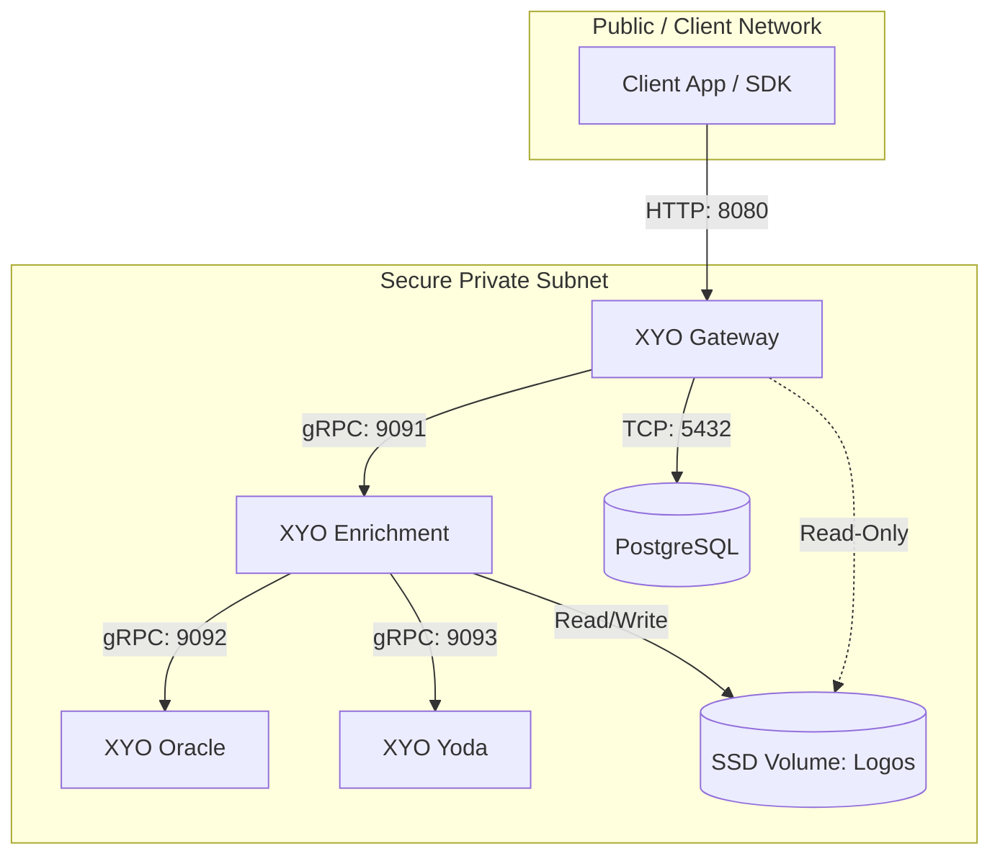

# Onboarding Enterprise & Government

# 🚀 XYO Onboarding
This documentation helps you to integrate XYO Enrichment Service as part of your infrastructure.

## 🧩 Components
<p align="center"></p>

### 📦 Linux Containers
- **XYO Gateway**: `HTTP` Server _(Entry point)_
- **XYO Enrichment**: `RPC` Server
- **XYO Oracle**: `RPC` Server
- **XYO Yoda**: `RPC` Server

>_**Oracle** or **Yoda** is not a commercial name, it's just a reference to the Oracle or Yoda docker image internally.
It's for remembering the purpose of the container._
> - **XYO Oracle**: _Because the great Oracle knows everything._
> - **XYO Yoda**: _Because Yoda is wise._

### 💾 Storage Volumes and Network
- **SSD Storage**: SSD storage for logos _(NVMe recommended)_
- **Private Network**: Private network for a secure communication for all containers

### 🗄️ Database <sup>(Containerised/External/Embedded)</sup>
- **Database**: A default database is PostgreSQL, but it can be adapted of your chosen database

---

## 🌐 Network and Connectivity
The XYO Enrichment Service relies on microservices communicating securely inside a private network subnet. Only the **XYO Gateway** needs to be exposed to your external client applications.



### 🔌 Port Matrix
| Component          | Default Port | Protocol | Access Level  | Description                                            |
|:-------------------|:-------------|:---------|:--------------|:-------------------------------------------------------|
| **XYO Gateway**    | `8080`       | HTTP     | Client-Facing | Serves the REST API for transaction enrichment.        |
| **XYO Enrichment** | `9091`       | TCP/RPC  | Internal Only | Internal RPC coordinator between AI models and caches. |
| **XYO Oracle**     | `9092`       | TCP/RPC  | Internal Only | Internal RPC pattern matcher database.                 |
| **XYO Yoda**       | `9093`       | TCP/RPC  | Internal Only | Internal RPC machine learning categorization service.  |
| **PostgreSQL**     | `5432`       | TCP      | Internal Only | Default transactional and cache database.              |

> 🚨 **Firewall Rule**: Ensure that ports `9091`, `9092`, and `9093` are blocked from receiving external ingress traffic, and are only accessible by containers within the private network.

---

## 🚚 Release and Distribution
Syniol Limited distributes the XYO Enrichment Service through container registries and compiled
binaries, enabling flexible integration in Docker, Kubernetes, or native virtualised infrastructure.

### 🐧 Linux Images
Official Docker images are hosted on Syniol’s private registry:
- **Registry Host**: `cr.syniol.com`
- **Images**:
    - `cr.syniol.com/xyo/gateway:<version>`
    - `cr.syniol.com/xyo/enrichment:<version>`
    - `cr.syniol.com/xyo/oracle:<version>`
    - `cr.syniol.com/xyo/yoda:<version>`

Authenticate locally or in your deployment pipelines:
```bash
docker login cr.syniol.com -u <your-client-id> -p <your-client-secret>
```

### 🔨 Binary Builds
For bare-metal or legacy virtual machine environments, Syniol distributes pre-compiled static binaries for standard Linux architectures:
- **Supported Architectures**: `Linux x86_64` (AMD64) and `ARM64`.
- **Distribution Portal**: Secure download portal at `https://downloads.syniol.com/xyo/`.
- **Verification**: SHA-256 checksums and GPG signature files (`.asc`) are provided for every build.

### 🐳 Docker & Kubernetes Support
Out-of-the-box infrastructure configurations are included directly in this repository:
- **Docker Compose**: Pre-configured environment located in [docker/](file:///Users/hadi/dev/start-ups/xyo/onboarding/docker). For deployment instructions, see [docker/README.md](file:///Users/hadi/dev/start-ups/xyo/onboarding/docker/README.md).
- **Kubernetes**: Production manifests and PVC configurations located in [kubernetes/](file:///Users/hadi/dev/start-ups/xyo/onboarding/kubernetes). For deployment instructions, see [kubernetes/README.md](file:///Users/hadi/dev/start-ups/xyo/onboarding/kubernetes/README.md).

---

## 🛠️ Using SDKs
Syniol provides official, type-safe SDK client libraries to simplify integration with the XYO Gateway HTTP API.

### 🐹 Go SDK
- **Package**: `github.com/syniol/xyo-sdk-go`
- **Install**:
  ```bash
  go get github.com/syniol/xyo-sdk-go
  ```
- **Example Usage**:
  ```go
  package main

  import (
      "context"
      "fmt"
      "log"

      "github.com/syniol/xyo-sdk-go/xyo"
  )

  func main() {
      // Initialize XYO client targeting your gateway endpoint
      client, err := xyo.NewClient(
          xyo.WithEndpoint("http://localhost:8080"),
          xyo.WithAPIKey("your-api-key"),
      )
      if err != nil {
          log.Fatalf("failed to initialize client: %v", err)
      }

      // Enrich a transaction payment string
      res, err := client.Enrich(context.Background(), &xyo.EnrichRequest{
          Description: "AMZN Mktp US*Amzn.com/bill WA",
          CountryCode: "US",
      })
      if err != nil {
          log.Fatalf("failed to enrich: %v", err)
      }

      fmt.Printf("Merchant: %s (Domain: %s)\n", res.Merchant.Name, res.Merchant.Domain)
      fmt.Printf("Category: %s (MCC: %s)\n", res.Category.Name, res.Category.MCC)
      fmt.Printf("Logo Asset: %s\n", res.Merchant.LogoURL)
  }
  ```

### 🟢 Node.js SDK
- **Package**: `@syniol/xyo-sdk-node`
- **Install**:
  ```bash
  npm install @syniol/xyo-sdk-node
  ```
- **Example Usage**:
  ```typescript
  import { XyoClient } from '@syniol/xyo-sdk-node';

  const client = new XyoClient({
    endpoint: 'http://localhost:8080',
    apiKey: 'your-api-key'
  });

  async function enrichTransaction() {
    try {
      const response = await client.enrich({
        description: 'NETFLIX.COM GBR',
        countryCode: 'GB'
      });

      console.log('Merchant Name:', response.merchant.name);
      console.log('Category:', response.category.name);
      console.log('MCC Code:', response.category.mcc);
      console.log('Logo:', response.merchant.logoUrl);
    } catch (error) {
      console.error('Enrichment failed:', error);
    }
  }

  enrichTransaction();
  ```

### 📚 Additional SDKs
Syniol also maintains official client SDKs for other ecosystems:
- **Rust Crate**: `xyo-sdk-rust` (on [crates.io](https://crates.io/crates/xyo-sdk-rust))
- **PHP Package**: `syniol/xyo-sdk-php` (on [packagist.org](https://packagist.org/packages/syniol/xyo-sdk-php))

---

## 🔑 Licence Verification
The XYO Enrichment Service requires a valid licence key provided by Syniol Limited to initialise
and download AI categorisation models.

### ☁️ Online Licensing
By default, the gateway and enrichment services check licence validity online:
1. Provide your key via the `XYO_LICENSE_KEY` environment variable.
2. The service establishes a secure TLS connection to `license.syniol.com:443`.
3. After verification, it retrieves cryptographic model keys to load the AI runtime.
4. **Heartbeats**: The service queries the server every 1 hour. If the connection is lost, it falls back
5. to a 7-day offline grace period.

### 🔒 Air-Gapped / Offline Licensing
For high-security on-premise deployments that prohibit outbound internet access, Syniol offers an offline cryptographic licence verification mode:
1. Syniol generates a digital licence signature file (`license.lic`) linked to your node CPU/hardware fingerprint or cluster domain.
2. Mount this file into the XYO containers at `/etc/xyo/license.lic` or define the file path using the `XYO_LICENSE_PATH` environment variable.
3. The containers validate the licence signature locally using a hardcoded public key, running 100% locally without external outbound traffic.


### 🔐 Licence & Governance
Copyright &copy; Syniol Limited. All rights reserved.
